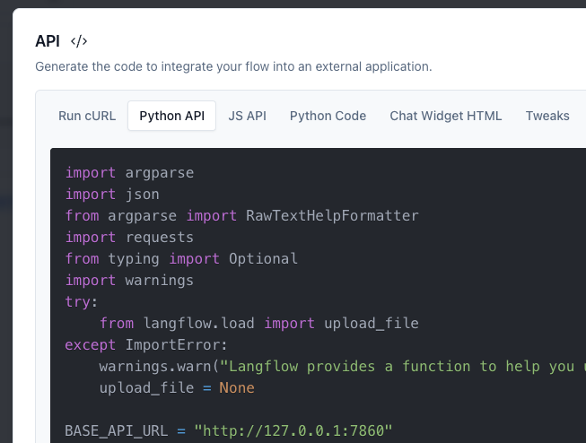

# WikiChat

This project is a starter for creating a chatbot using Astra DB. It's designed to be easy to deploy and use, with a focus on performance and usability.

## Features

- **Astra DB Integration**: Store and retrieve data from your Astra DB database with ease.
- **LangChain.js Integration**: Uses the new Astra DB vectorstore to implement RAG.
- **Easy Deployment**: Deploy your chatbot to Vercel with just a few clicks.
- **Customizable**: Modify and extend the chatbot to suit your needs.

## Getting Started

### Prerequisites

- An Astra DB account. You can [create one here](https://astra.datastax.com/register).
    - An Astra Vector Database
- An OpenAI Account and API key.
- A Cohere Account and API key. Note that due to the large volume of ingested data, you'll need a paid plan.

### Setup

1. Clone this repository to your local machine.
2. Install the dependencies by running `npm install` in your terminal.
3. Set up the following environment variables in your IDE or `.env` file:
    - `ASTRA_DB_API_ENDPOINT`: Your Astra DB vector database id **_in a vector-enabled DB_**
    - `ASTRA_DB_APPLICATION_TOKEN`: The generated app token for your Astra database
        - To create a new token go to your database's `Connect` tab and click `Generate Token`. (your Application Token begins with `AstraCS:...`)
    - `OPENAI_API_KEY`: Your OpenAI API key.
    - `COHERE_API_KEY`: Your Cohere API key for embeddings.
    - `LANGCHAIN_TRACING_V2` (optional): Set to `true` to enable tracing
    - `LANGCHAIN_SESSION` (optional): The LangSmith project that will receive traced runs.
    - `LANGCHAIN_API_KEY` (optional): LangSmith API key
    - `LANGFLOW_APPLICATION_TOKEN` (required for Astra): Langflow application token. (It should start with AstraCS:)
    - `FLOW_ID_OR_NAME`: ID of LangFlow flow
    - `LANGFLOW_ID` (required for Astra): ID of the LangFlow instance
    - `LANGFLOW_BASE_URL`: e.g. http://127.0.0.1:7860 for local.

    Many of these variables are provided by the code generated in LangFlow, like here: 
    
    In Astra, the token for LangFlow can be generated on that same screen.

4. Populate your database by following the instructions [here](https://github.com/datastax/wikichat/blob/main/scripts/README.md)

### Running the Project

To start the development server, run `npm run dev` in your terminal. Open [http://localhost:3000](http://localhost:3000) to view the chatbot in your browser.

## Deployment

You can easily deploy your chatbot to Vercel by clicking the button below:

[](https://vercel.com/new/clone?repository-url=https://github.com/devinbost/wikichat&env=ASTRA_DB_API_ENDPOINT,ASTRA_DB_APPLICATION_TOKEN,OPENAI_API_KEY,COHERE_API_KEY)

Remember to set your environment variables to the values obtained when setting up your Astra DB and OpenAI accounts.


---

## Initial setup:

Add the MySQL database setup script (that creates the required tables and populates them) in `./mysql-init/`
This script will be invoked to populate the database automatically when starting `docker-compose`
Note that since this MySQL database has plain text credentials stored in the compose file, it should only be used for testing.

### Setup ollama
Install ollama from the main website

Run:
`ollama pull llama3.1:latest`
from your terminal.
This downloads the model that we will bundle into the docker deployment. 

Running the Ollama docker image requires following these instructions on the host machine to support the Nvidia drivers (for GPU support): https://hub.docker.com/r/ollama/ollama

Then, run `cp -r ~/.ollama/models/* ./models`
(There's an empty models directory created for you.)

### HuggingFace setup
Run steps to download huggingface model to `huggingface/(model name)` like:
`huggingface/all-MiniLM-L12-v2` into the root directory.
```
from sentence_transformers import SentenceTransformer
modelPath = "path/to/app/huggingface/all-MiniLM-L12-v2"

model = SentenceTransformer('sentence-transformers/all-MiniLM-L12-v2')
model.save(modelPath)
```
This is the directory that will be used in the env file for docker.

### Environment variables:
Create two env files:

- `.env.non-docker` (for local development & testing)
- `.env.docker` (for deployment)

The difference is that `.env.docker` uses environment variables that are associated with docker networking.

```
ASTRA_DB_API_ENDPOINT=https://....astra.datastax.com
ASTRA_DB_APPLICATION_TOKEN=AstraCS:kGW...
ASTRA_DB_NAMESPACE=default_namespace
OPENAI_API_KEY=sk-proj-9H...
# Optional: Set up tracing
# LANGCHAIN_TRACING_V2="true"
# LANGCHAIN_SESSION="wikichat"
# LANGCHAIN_API_KEY="ls..."

#Fiddler Ingestion
# FIDDLER_MODEL_ID=REPLACE_ME
# FIDDLER_TOKEN=REPLACE_ME
# FIDDLER_BASE_URL=REPLACE_ME

#Langflow Calling
LANGFLOW_APPLICATION_TOKEN=AstraCS:g...
# SIA v2 chat:
FLOW_ID_OR_NAME=openai_flow
# To run the huggingface/ollama flow, use:
# FLOW_ID_OR_NAME=local_flow
LANGFLOW_ID=453...
LANGFLOW_BASE_URL=http://127.0.0.1:7860
NEXT_PUBLIC_LANGFLOW_BASE_URL=http://127.0.0.1:7860

# Put all of your LangFlow variables in here.
OPENAI_KEY=sk-proj-9...
ASTRA_DB_TOKEN=AstraCS:Tq...
ASTRA_ENDPOINT=https://...apps.astra.datastax.com
ASTRA_DB_DATABASE_ID=c8...
MYSQL_DB=MYSQL # note that mysql is case sensitive for the DB name
MYSQL_USER=root
MYSQL_PASSWORD=example
MYSQL_HOST=localhost

DEBUG=-next:jsconfig-paths-plugin,* npm run dev

OLLAMA_HOST=http://localhost:11434

HUGGINGFACE_MODEL_PATH=sentence-transformers/all-MiniLM-L12-v2
```


In the `.env.docker` version, use these values instead:
```
LANGFLOW_BASE_URL=http://langflow:7860
NEXT_PUBLIC_LANGFLOW_BASE_URL=http://langflow:7860
MYSQL_HOST=host.docker.internal (if mysql is running on host machine)

HUGGINGFACE_MODEL_PATH=/app/huggingface/all-MiniLM-L12-v2
```

## Local testing:
Command for starting the app locally for debugging/testing:
`LANGFLOW_STORE_ENVIRONMENT_VARIABLES=true LANGFLOW_VARIABLES_TO_GET_FROM_ENVIRONMENT=ASTRA_ENDPOINT,ASTRA_DB_TOKEN,ASTRA_DB_DATABASE_ID,OPENAI_KEY,MYSQL_DB,MYSQL_USER,MYSQL_PASSWORD,MYSQL_HOST,LANGCHAIN_TRACING_V2,LANGCHAIN_SESSION,LANGCHAIN_API_KEY,OLLAMA_HOST python -m langflow run --env-file /Users/devin.bost/proj/repos/wikichat/.env.non-docker`
Then, run:
`npm dev run`

## Docker testing:
To test the docker deployment, run this:
`docker-compose down; clear; docker-compose up --build 2>&1 | tee output.log`
Then, go to localhost:3000 to access the app.


